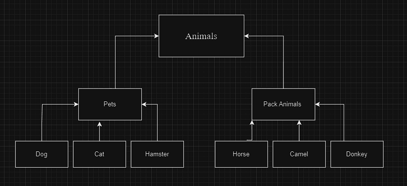

# Астахов Илья. Группа 4830

# Операционные системы и виртуализация (Linux)

## Использование команды `cat` в Linux

### Создание текстовых файлов

- Создать два текстовых файла: "Pets"(Домашние животные) и "Pack
  animals"(вьючные животные), используя команду `cat` в терминале Linux. В
  первом файле перечислить собак, кошек и хомяков. Во втором — лошадей,
  верблюдов и ослов.
- Объединить содержимое этих двух файлов в один и просмотреть его
  содержимое.
- Переименовать получившийся файл в "Human Friends"(.
  Пример конечного вывода после команды “ls” :
  Desktop Documents Downloads HumanFriends.txt Music PackAnimals.txt
  Pets.txt Pictures Videos
```` bash
ilya@ilya-Linux:~$ cat Pets
собаки
кошки
хомяки
ilya@ilya-Linux:~$ cat PackAnimals
лошади
верблюды
ослы
````
```` bash
ilya@ilya-Linux:~$ cat Pets Pac_animals > "Human Friends"
ilya@ilya-Linux:~$ cat "Human Friends"
собаки
кошки
хомяки
лошади
верблюды
ослы
ilya@ilya-Linux:~$ ls
cd                   snap
clean_directory.sh   test_directory
dbui                 virtualbox-7.0_7.0.12-159484~Ubuntu~jammy_amd64.deb
dbui.sh              virtualbox-7.0_7.0.12-159484~Ubuntu~jammy_amd64.deb.1
homeWork             wordpress
'Human Friends'       Видео
newfile3             Документы
newfilenew           Загрузки
ownersort.sh         Изображения
Pac_animals          Музыка
Pack                 Общедоступные
Pets                'Рабочий стол'
shared               Шаблоны
```` 
## Работа с директориями в Linux
- Создать новую директорию и переместить туда файл "Human Friends".

```` bash
ilya@ilya-Linux:~$ mkdir Animals
ilya@ilya-Linux:~$ mv 'Human Friends' Animals
ilya@ilya-Linux:~$ cd Animals
ilya@ilya-Linux:~/Animals$ ll
итого 12
drwxrwxr-x  2 ilya ilya 4096 фев 12 20:39  ./
drwxr-x--- 22 ilya ilya 4096 фев 12 20:39  ../
-rw-rw-r--  1 ilya ilya   78 фев 12 20:15 'Human Friends'
````
# Работа с MySQL в Linux. “Установить MySQL на вашу вычислительную
машину ”
- Подключить дополнительный репозиторий MySQL и установить один из
  пакетов из этого репозитория.

```` bash
wget https://dev.mysql.com/get/mysql-apt-config_0.8.26-1_all.deb
sudo dpkg -i mysql-apt-config_0.8.26-1_all.deb
sudo apt install mysql-client mysql-community-server mysql-server
sudo apt update
sudo mysql_secure_installation
sudo mysql
Welcome to the MySQL monitor.  Commands end with ; or \g.
Your MySQL connection id is 10
Server version: 8.0.35-0ubuntu0.22.04.1 (Ubuntu)
````
## Управление deb-пакетами
- Установить и затем удалить deb-пакет, используя команду `dpkg`.
```` bash
sudo apt update
sudo apt install htop
sudo apt remove htop
````
##  История команд в терминале Ubuntu
- Сохранить и выложить историю ваших терминальных команд в Ubuntu.
  В формате: Файла с ФИО, датой сдачи, номером группы(или потока)
```` bash
760  cat > Pets <<EOF
собаки
кошки 
хомяки
EOF

  761  cat > Pack animals <<EOF
лошади
верблюды
ослы 
EOF

  762  cat > Pac_animals <<EOF
лошади
верблюды
ослы 
EOF

  763  cat Pets
  764  cat pac_animals
  765  ll
  766  cat pets
  767  cat Pets
  768  cat Pet_animals
  769  cat Pets
  770  cat Pac_animals
  771  cat Pets Pac_animals > "Human Friends"
  772  cat "Human Friends"
  773  ls
  774  mkdir Animals
  775  mv 'Human Friends' Animals
  776  cd Animals
  777  ll
  778  wget https://dev.mysql.com/get/mysql-apt-config_0.8.26-1_all.deb
  779  sudo dpkg -i mysql-apt-config_0.8.26-1_all.deb
  780  sudo apt install mysql-client mysql-community-server mysql-server
  781  sudo apt update
  782  sudo mysql_secure_installation
  783  sudo mysql
  784  sudo apt update
  785  sudo apt install htop
  786  history
````

# Объектно-ориентированное программирование

## Диаграмма классов
- Создать диаграмму классов с родительским классом "Животные", и двумя
  подклассами: "Pets" и "Pack animals".
  В составы классов которых в случае Pets войдут классы: собаки, кошки,
  хомяки, а в класс Pack animals войдут: Лошади, верблюды и ослы).
  Каждый тип животных будет характеризоваться (например, имена, даты
  рождения, выполняемые команды и т.д)
  Диаграмму можно нарисовать в любом редакторе, такими как Lucidchart,
  Draw.io, Microsoft Visio и других.
  


# Работа с MySQL
(Задача выполняется в случае успешного выполнения
   задачи “Работа с MySQL в Linux. “Установить MySQL на вашу машину”

   7.1. После создания диаграммы классов в 6 пункте, в 7 пункте база данных
   "Human Friends" должна быть структурирована в соответствии с этой
   диаграммой. Например, можно создать таблицы, которые будут
   соответствовать классам "Pets" и "Pack animals", и в этих таблицах будут поля,
   которые характеризуют каждый тип животных (например, имена, даты
   рождения, выполняемые команды и т.д.).
   В ранее подключенном MySQL создать базу данных с названием
   "Human Friends".
- Создать таблицы, соответствующие иерархии из вашей диаграммы
  классов.
- Заполнить таблицы данными о животных, их командах и датами
  рождения
```` roomsql 
-- Создание таблицы Pets
CREATE TABLE IF NOT EXISTS Pets (
    ID INT AUTO_INCREMENT PRIMARY KEY,
    Name VARCHAR(255),
    Type VARCHAR(255),
    BirthDate DATE,
    Commands VARCHAR(255)
);

-- Заполнение таблицы Pets данными
INSERT INTO Pets (Name, Type, BirthDate, Commands) VALUES 
('Artur', 'Dog', '2020-01-01', 'Sit, Stay, Fetch'),
('Ilya', 'Cat', '2019-05-15', 'Sit, Pounce'),
('Masha', 'Hamster', '2021-03-10', 'Roll, Hide'),
('Emir', 'Dog', '2018-12-10', 'Sit, Paw, Bark');

-- Создание таблицы PackAnimals
CREATE TABLE IF NOT EXISTS PackAnimals (
    ID INT AUTO_INCREMENT PRIMARY KEY,
    Name VARCHAR(255),
    Type VARCHAR(255),
    BirthDate DATE,
    Commands VARCHAR(255)
);

-- Заполнение таблицы PackAnimals данными
INSERT INTO PackAnimals (Name, Type, BirthDate, Commands) VALUES 
('Kate', 'Horse', '2015-07-21', 'Trot, Canter, Gallop'),
('Sasha', 'Camel', '2016-11-03', 'Walk, Carry Load'),
('Alex', 'Donkey', '2017-09-18', 'Walk, Carry Load, Bray'),
('Messi', 'Horse', '2014-05-05', 'Trot, Canter'),
('Ovechkin', 'Camel', '2018-12-12', 'Walk, Sit'),
('Biden', 'Donkey', '2019-01-23', 'Walk, Bray, Kick');
````
- Удалить записи о верблюдах и объединить таблицы лошадей и ослов.
```` roomsql 
-- Удаление записей о верблюдах:
DELETE FROM PackAnimals WHERE Type = 'Camel' OR Type = 'Donkey';

-- Объединение таблиц лошадей и ослов:
CREATE TABLE HorsesAndDonkeys AS
SELECT * FROM PackAnimals WHERE Type = 'Horse'
UNION ALL
SELECT * FROM PackAnimals WHERE Type = 'Donkey';
````
- Создать новую таблицу для животных в возрасте от 1 до 3 лет и вычислить
  их возраст с точностью до месяца.
```` roomsql 
-- создадим новую таблицу для животных в возрасте от 1 до 3 лет и вычислим их возраст с точностью до месяца:
CREATE TABLE AnimalsAgeBetween1And3 AS
SELECT *, TIMESTAMPDIFF(YEAR, BirthDate, CURDATE()) AS AgeInYears,--  Это выражение вычисляет разницу в годах между датой рождения животного (BirthDate) и текущей датой (CURDATE()),
--  и присваивает результат новому столбцу с именем AgeInYears 

TIMESTAMPDIFF(MONTH, BirthDate, CURDATE()) % 12 AS AgeInMonths -- Это выражение вычисляет разницу в месяцах между датой рождения животного (BirthDate) и текущей датой (CURDATE())
-- , затем берет остаток от деления на 12,
--  чтобы получить количество месяцев в текущем году, и присваивает результат новому столбцу с именем AgeInMonths. 

FROM (SELECT * FROM Pets
      UNION ALL --  UNION ALL используется для объединения данных из двух таблиц без удаления дубликатов. 
      SELECT * FROM HorsesAndDonkeys) AS AllAnimals
WHERE TIMESTAMPDIFF(YEAR, BirthDate, CURDATE()) BETWEEN 1 AND 3; -- Это условие фильтрации данных. Здесь выбираются только те записи, 
-- у которых возраст животного (вычисленный в предыдущих выражениях) находится в диапазоне от 1 до 3 лет.
````
- Объединить все созданные таблицы в одну, сохраняя информацию о
  принадлежности к исходным таблицам.
```` roomsql
--  объединим все созданные таблицы в одну, сохраняя информацию о принадлежности к исходным таблицам. 
-- Для этого нужно будет добавить столбец, указывающий на тип животного: 
ALTER TABLE Pets ADD AnimalType VARCHAR(50) DEFAULT 'Pet';
ALTER TABLE HorsesAndDonkeys ADD AnimalType VARCHAR(50) DEFAULT 'PackAnimal';

INSERT INTO AnimalsAgeBetween1And3 (ID, Name, Type, BirthDate, Commands, AgeInYears, AgeInMonths, AnimalType)
SELECT ID, Name, Type, BirthDate, Commands, AgeInYears, AgeInMonths, AnimalType FROM Pets;
INSERT INTO AnimalsAgeBetween1And3 (ID, Name, Type, BirthDate, Commands, AgeInYears, AgeInMonths, AnimalType)
SELECT ID, Name, Type, BirthDate, Commands, AgeInYears, AgeInMonths, AnimalType FROM HorsesAndDonkeys;
````


